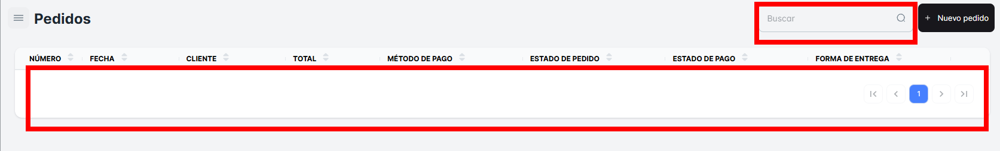
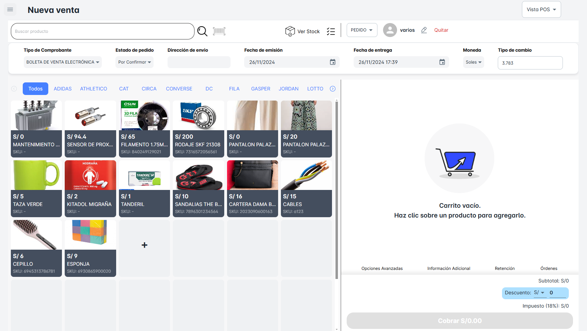

# Pedidos

En este módulo, podrás realizar la **búsqueda de "Pedidos"**. Aquí podrás visualizar todo el listado de pedidos realizados en tu empresa, filtrados por fecha o criterios específicos.

Podrás acceder a los siguientes detalles de cada pedido:

- **Cliente**: Nombre o información del cliente que realizó el pedido.
- **Fecha de Pago**: La fecha en la que se realizó el pago del pedido.
- **Métodos de Pago**: El tipo de pago utilizado (tarjeta, efectivo, transferencia, etc.).
- **Estado del Pedido**: El estado actual del pedido, como "Pendiente", "En Proceso", "Enviado", "Entregado", entre otros.
- **Estado de Pago**: El estado del pago, que puede ser "Pagado", "Pendiente", "Parcial", etc.
- **Forma de Entrega**: El método de entrega seleccionado para el pedido, como "Envío a domicilio", "Recogida en tienda", "Entrega programada", etc.

**Busqueda de Pedidos**.

Podrás realizar un "Nuevo Pedido" dando clic en el botón correspondiente. Al hacer esto, se abrirá una nueva ventana emergente que te permitirá crear una "Nueva Venta".

[Realizar Nuevo Pedido](./a_nuevaventa.md)

