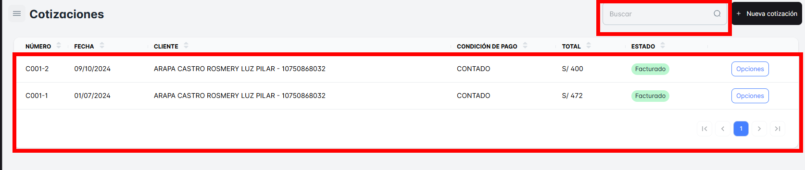
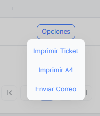
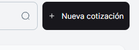
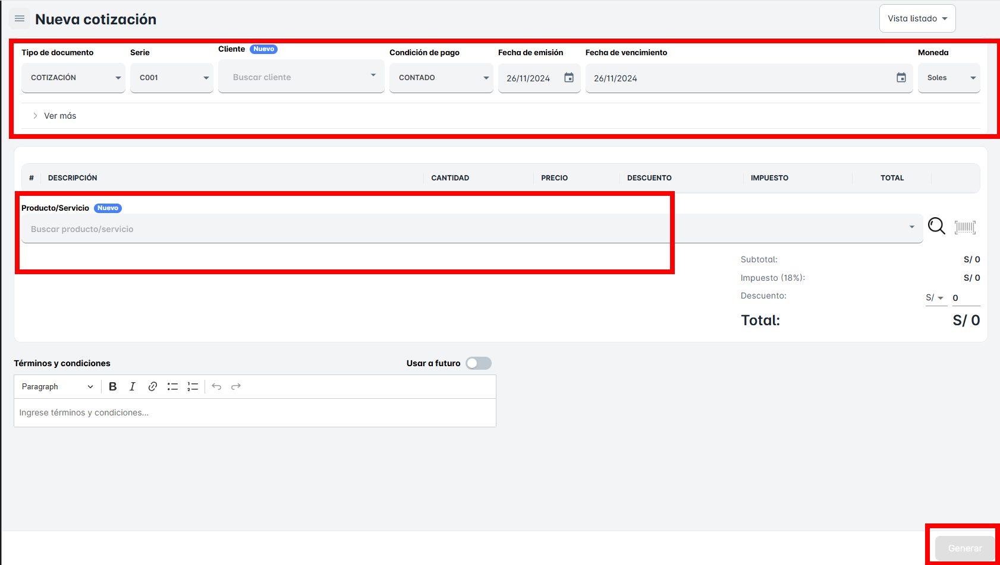

# Cotización

En este módulo, podrás realizar la **búsqueda de "Cotizaciones"**. Aquí podrás visualizar todo el listado de cotizaciones realizadas en tu empresa, filtradas por fecha o criterios específicos.

Podrás acceder a los siguientes detalles de cada cotización:

- **Cliente**: Nombre o información del cliente que solicitó la cotización.
- **Condición de Venta**: Los términos o condiciones de pago y entrega acordados con el cliente.
- **Fecha de Emisión**: La fecha en la que se emitió la cotización.
- **Importe**: El monto total de la cotización, que incluye los productos o servicios solicitados.

**Busqueda de Cotizaciones**.

En esta sección, al hacer clic en el botón **"Opciones"**, podrás seleccionar una forma de impresión o modalidad de envió

- **Imprimir Ticket**
- **Imprimir A4**
- **Enviar Correo**: Esta opción te permitirá enviar el documento directamente al correo electrónico del cliente.

### Para crear una **"Nueva Cotización"**

Simplemente deberás dar clic en el botón correspondiente. Al hacerlo, se abrirá una **nueva ventana emergente** donde podrás ingresar todos los detalles necesarios para la cotización.

En esta ventana emergente, podrás:

1. **Seleccionar el cliente**: Elige al cliente al que se le realizará la cotización.
2. **Condición de pago**: Define las condiciones de pago acordadas, como plazos o métodos de pago.
3. **Fecha de emisión**: Establece la fecha en la que se está generando la cotización.
4. **Fecha de vencimiento**: Indica la fecha límite hasta la cual la cotización es válida.
5. **Seleccionar producto**: Elige los productos o servicios de la lista desplegable, agregándolos a la cotización.
6. **Dar clic en “Generar”**: Una vez que hayas completado todos los campos, haz clic en el botón **"Generar"** para crear la cotización.

**Crear una Nueva Cotizacion**.
