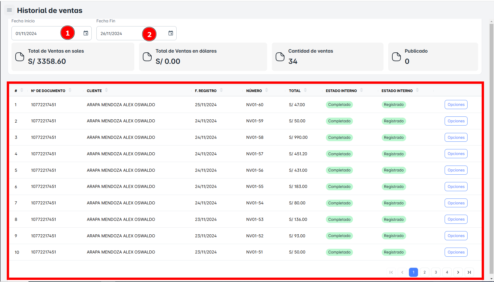
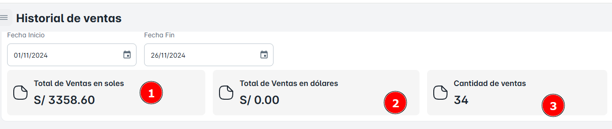
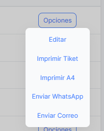

# Historial de Ventas

En el módulo de "Historial de Ventas", podrás acceder a toda la lista de ventas realizadas dentro del rango de fechas que determines. Al ingresar las fechas de inicio y fin, podrás filtrar y visualizar todas las transacciones realizadas en ese periodo específico.

**Historial de Ventas**.
 

En el módulo de **"Historial de Ventas"**, podrás visualizar información clave sobre las ventas realizadas en el rango de fechas que selecciones, incluyendo:

- **Total de ventas en Soles**: El monto total de todas las ventas realizadas en la moneda local (S/).
- **Total de ventas en Dólares**: El monto total de las ventas realizadas en dólares (USD), si se han hecho en esta moneda.
- **Cantidad de ventas**: El número total de transacciones o ventas realizadas en el periodo seleccionado.

**Medidores de Ventas**.
 

En el botón **"Opciones"**, podrás acceder a las siguientes funcionalidades para gestionar las ventas o documentos relacionados:

1. **Editar**: Te permitirá modificar los detalles de la venta.
2. **Imprimir Ticket**: Te dará la opción de generar e imprimir un ticket.
3. **Imprimir A4**
4. **Enviar a WhatsApp**: Esta opción te permitirá enviar el comprobante de la venta directamente al número de WhatsApp del cliente.
5. **Enviar Correo**: Podrás enviar el comprobante de la venta al correo electrónico del cliente.

 
